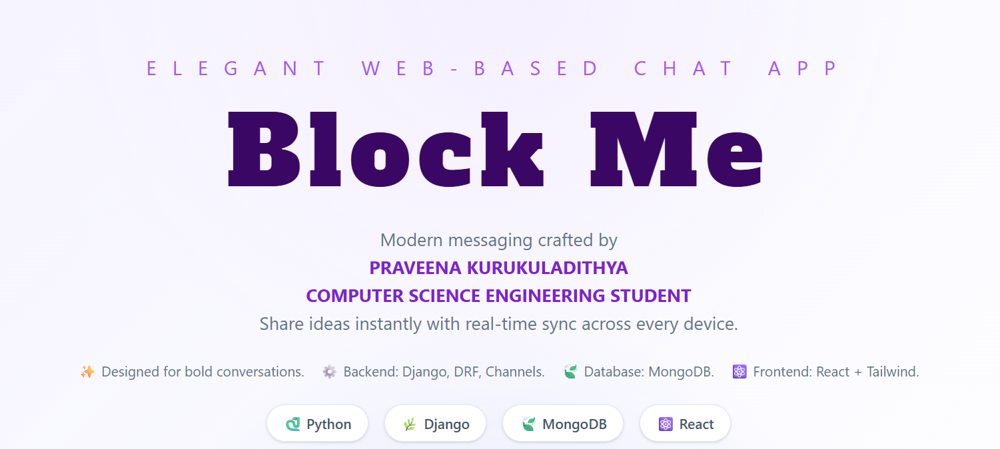

# Block Me 🚀

Modern real-time chat built by **Praveena Kurukuladithya** (Computer Science & Engineering student). Django + DRF + Channels on the backend, MongoDB for messages, React + Tailwind for the UI.

## 📸 Preview


---

## ✨ Highlights
- 🔐 Session-based auth (login/register/logout), profile avatars & bio
- 💬 One-to-one rooms + WebSockets with HTTP fallback
- 🍃 MongoDB for message history; SQLite (dev) for auth/session
- 🌓 Light/dark mode toggle
- 🧭 Facebook-style landing with streamlined login/signup
- 🖼️ Profile management: update username/email/bio, upload avatar

## 🧰 Tech Stack
- **Backend**: Python 3.12, Django 4.2, DRF, Channels, django-cors-headers, Pillow
- **DB**: MongoDB (messages), SQLite dev (auth/session)
- **Frontend**: React (CRA), Tailwind CSS, Axios, React Router
- **Realtime**: Channels (in-memory for dev) + WebSockets

## ⚙️ Prerequisites
- Python 3.12+
- Node.js 18+ and npm
- MongoDB running locally at `mongodb://localhost:27017/` (default)

## 🛠️ Backend Setup
```bash
cd backend
python -m venv .venv
. .venv/Scripts/activate      # PowerShell
pip install -r requirements.txt
python manage.py migrate
python manage.py runserver 0.0.0.0:8000
```
Env overrides:
- `MONGODB_URI` (default `mongodb://localhost:27017/`)
- `MONGODB_DB` (default `chat_app_db`)
- `MONGODB_COLLECTION` (default `messages`)

## 🎨 Frontend Setup
```bash
cd frontend
npm install
npm start
```
CRA dev server proxies `/api` + `/ws` to `http://localhost:8000` via `src/setupProxy.js`.

Build:
```bash
cd frontend
npm run build
```

## 🔗 Key Endpoints
- Auth: `POST /accounts/register/`, `POST /accounts/login/`, `POST /accounts/logout/`, `GET /accounts/me/`
- Users: `GET /accounts/users/`
- Profile: `GET/PUT /accounts/profile/` (multipart for avatar upload)
- Messages (REST): `GET/POST /chat/messages/<room_name>/`
- WebSocket: `ws://localhost:8000/ws/chat/<room_name>/`

## 🗂️ Structure
- `backend/` — Django project; apps: `accounts` (auth/profile), `chat` (messages, channels)
- `frontend/` — React app; components for auth, user list, chat window, profile modal

## 🚢 Production Notes
- Use a production ASGI stack (e.g., gunicorn/uvicorn or daphne)
- Swap in Redis for the channel layer (instead of in-memory)
- Set `DEBUG=False`, configure `ALLOWED_HOSTS`, static/media hosting, secure cookies/CSRF
- Build/serve React (e.g., nginx) or host separately; set `REACT_APP_API_BASE` / `REACT_APP_WS_BASE`

## 👤 Owner
**Praveena Kurukuladithya**  
Computer Science & Engineering student
